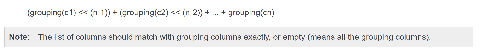

# funtions
1. pyspark.sql.functions.abs(col)---返回绝对值
2. pyspark.sql.functions.acos(col)--返回计算给定值的反余弦，该值在0到π之间
3. **pyspark.sql.functions.add_months(start, months)--返回start的月份加上months的结果（不仅是月份会返回）**
4. pyspark.sql.functions.approxCountDistinct(col, rsd=None) ---在2.1版本中使用 approx_count_distinct 来代替。
5. pyspark.sql.functions.approx_count_distinct(col, rsd=None)--返回原来的列的近似非重复数作为一个新的列
6. pyspark.sql.functions.array(*cols)--创建一个新的列名的数组。
> 参数：字符串形式的列名的列表，或者有相同数据类型的列表达式的列表
7. pyspark.sql.functions.array_contains(col, value)--集合函数：如果数组为null，返回null；如果数组包含给定的值，返回true，否则返回false。
> 参数：col--列名字的数组
> value--在数组要被检查的值
8. pyspark.sql.functions.asc(col)--返回给定列名的升序排列的结果
9. pyspark.sql.functions.ascii(col)--计算string列的第一个字符的numeric 值
10. pyspark.sql.functions.asin(col)--计算给定值的反sin值，在-π/2和π/2之间
11. pyspark.sql.functions.atan(col)--计算给定值的反tan值
12. pyspark.sql.functions.atan2(col1, col2)--返回直角坐标（x，y）拓扑坐标（r，theta）转换后的θ角
13. pyspark.sql.functions.avg(col)--聚集函数：返回一个组的平均值
14. pyspark.sql.functions.base64(col)--计算二进制列的BASE64 编码，返回它作为一个string列
15. pyspark.sql.functions.bin(col)--返回给定列的二进制值的string表示
16. pyspark.sql.functions.bitwiseNOT(col)--计算按位非运算。
17. pyspark.sql.functions.broadcast(df)--标记一个足够小的dataframe来用于广播连接。
18. pyspark.sql.functions.bround(col, scale=0)--如果比例大于等于0，则使用半偶数舍入模式将给定值舍入到小数位数，如果比例小于0，则在整数部分舍入。
19. pyspark.sql.functions.cbrt(col)--计算给定值得立方根
20. pyspark.sql.functions.ceil(col)--向上取整
21. pyspark.sql.functions.coalesce(*cols)--返回第一个不为null的值
22. pyspark.sql.functions.col(col)--返回给定的一列
23. pyspark.sql.functions.collect_list(col)--聚集函数：返回有重复值对象的列表
24. pyspark.sql.functions.collect_set(col)--聚集函数：返回有重复值对象的集合
25. pyspark.sql.functions.column(col)--返回给定的一列
26. pyspark.sql.functions.concat(*cols)--将多个cols值连接成一个，中间没有其他字符
27. pyspark.sql.functions.concat_ws(sep, *cols)--使用sep分隔符，将多个cols值连接成一个
28. pyspark.sql.functions.conv(col, fromBase, toBase)--将给定的列从一个进制fromBase转换为另一种进制toBase
29. pyspark.sql.functions.corr(col1, col2)--计算col1,col2的皮尔逊相关性
30. pyspark.sql.functions.cos(col)--计算给定值得cos值
31. pyspark.sql.functions.cosh(col)--计算给定值得双曲余弦值
32. pyspark.sql.functions.count(col)--聚集函数：返回一个组的成员数
33. pyspark.sql.functions.countDistinct(col, *cols)--返回给定列的不同成员数（换句话说是有多少个不同的给定列）
34. pyspark.sql.functions.covar_pop(col1, col2)--返回col1,col2的总体协方差作为新的一列
35. pyspark.sql.functions.covar_samp(col1, col2)--返回col1,col2的样本协方差作为新的一列
36. pyspark.sql.functions.crc32(col)--计算二进制列的循环冗余校验值（CRC32），并将该值作为bigint返回。
37. pyspark.sql.functions.create_map(*cols)--创建一个新的映射列（将多个列弄成字典形式）
> 参数：string形式的列名的列表 or 分组作为键值对的列表达式的列表
38. pyspark.sql.functions.cume_dist()--窗口函数：返回窗口分区内值的累积分布，即当前行以下的行的分数。
39. pyspark.sql.functions.current_date()--放回当前日期作为日期列
40. pyspark.sql.functions.current_timestamp()--返回当前时间戳作为时间戳列
41. pyspark.sql.functions.date_add(start, days)--返回start days天之后的日期（也就是start+days得到的那天）
42. pyspark.sql.functions.date_format(date, format)--将date/timestamp/string转换成由第二个参数给定时间格式的string，举个例子：dd.MM.yyyy对应的是诸如18.03.1993；java.text.SimpleDateFormat 这个类的模式字符都可以用
>>> df = spark.createDataFrame([('2015-04-08',)], ['a'])
>>> df.select(date_format('a', 'MM/dd/yyy').alias('date')).collect()
        [Row(date=u'04/08/2015')]
43. pyspark.sql.functions.date_sub(start, days)--返回start之前days天的那天（也就是说start-days即为返回的那天）
44. pyspark.sql.functions.datediff(end, start)--返回start到end之间的天数
45. pyspark.sql.functions.dayofmonth(col)--提取给定时间的月的日数作为整型值返回（也就是说给定时间在该月的第几天）
46. pyspark.sql.functions.dayofyear(col)--提取给定时间的年的日数作为整型值返回（也就是说给定时间在该年的第几天）
47. pyspark.sql.functions.decode(col, charset)--将给定列从二进制编码转为提供的编码格式，以string的形式返回
48. pyspark.sql.functions.degrees(col)--将以弧度度量的角度转换为以角度度量的近似等效角度。（弧度制转为角度制）
49. pyspark.sql.functions.dense_rank()--窗口函数：以没有间隔的方式返回行在窗口分区的排名；rank和dense_rank的差别是在有多个行是排名相同时，rank会考虑占位，也就是如果排名为2的有3行，那么下一个就是排名为5的了，中间3,4,没有了，但是dense_rank不考虑占位，下一个排名还是3，不管排名为2的有多少个。这个函数等价于SQL里面的DENSE_RANK函数。
50. pyspark.sql.functions.desc(col)--在给定列进行降序排序，并将排序的结果返回
51. pyspark.sql.functions.encode(col, charset)--利用提供的字符集将给定的第一个参数的string编码成二进制
52. pyspark.sql.functions.exp(col)--计算给定值的指数
53. pyspark.sql.functions.explode(col)--为给定数组或映射中的每个元素返回新行
54. pyspark.sql.functions.expm1(col)--计算给定值减去1的指数。
55. pyspark.sql.functions.expr(str)--将表达式字符串解析为它所表示的列
56. pyspark.sql.functions.factorial(col)--计算给定值的阶乘
57. pyspark.sql.functions.first(col, ignorenulls=False)--聚集函数：返回每个组的第一个值；这个函数默认返回第一个值，如果ignorenulls设置为true，那么将返回第一个不为null的值；如果所有值都为null那么返回null
58. pyspark.sql.functions.floor(col)--计算给定值的向下取整
59.   pyspark.sql.functions.format_number(col, d)--将数字列col利用half_even（向最接近数字方向舍入的舍入模式，如果与两个相邻数字的距离相等，则向相邻的偶数舍入。如果舍弃部分左边的数字为奇数，则舍入行为同RoundingMode.HALF_UP；如果为偶数，则舍入行为同RoundingMode.HALF_DOWN）舍入一次，再精度转为保留d位有效数字。
60. pyspark.sql.functions.format_string(format, *cols)--以可打印的格式将参数格式化，并将结果字符串返回
61. pyspark.sql.functions.from_json(col, schema, options={})--将包含json的string形式的列转换成特定schema下的StructType或者StructType的数组形式；如果不能转换该字符串，那么返回null
> col---json格式的string列
> schema---在转换json列时使用的StructType或者StructType的数组
> options ---控制转换的可选项，允许json数据库下相同的可选项
62. pyspark.sql.functions.from_unixtime(timestamp, format='yyyy-MM-dd HH:mm:ss')--计算format参数代表的时间戳字符串和Unix标准时间 1970-01-01 00:00:00 UTC相差的秒数
63. pyspark.sql.functions.from_utc_timestamp(timestamp, tz)--给一个对应UTC具体时间的时间戳，返回给定时区的对应时间戳
64. pyspark.sql.functions.get_json_object(col, path)-- 从指定的json路径的json字符串解析出json对象，返回解析出的json对象的json字符串，如果输入的json字符串不合法，返回null
> col ---json格式的字符串类型的列
> path ---要解析的json对象的路径
65. pyspark.sql.functions.greatest(*cols)--返回给定列的名字的列表中的最大值，跳过null值，最少要2个参数，如果所有参数为null，返回null
66. pyspark.sql.functions.grouping(col)--聚集函数：指示是否聚合分组依据列表中的指定列，在结果集中为聚合返回1，为未聚合返回0。
67. *pyspark.sql.functions.grouping_id(*cols)--聚集函数：返回分组层次*

68. pyspark.sql.functions.hash(*cols)--计算给定列的hash值，并返回一个整型列
69. pyspark.sql.functions.hex(col)--计算给定列的16进制值，该列应该是 pyspark.sql.types.StringType, pyspark.sql.types.BinaryType, pyspark.sql.types.IntegerType or pyspark.sql.types.LongType这几种之一。
70. pyspark.sql.functions.hour(col)--获取给定时间戳的小时数
71. pyspark.sql.functions.isnan(col)--如果列是NaN，返回true，否则false
72. pyspark.sql.functions.isnull(col)--如果列是null，返回true，否则false
73. pyspark.sql.functions.json_tuple(col, *fields)--为json列根据提供的字段名字创建新的一行
> col---json格式的string列
> fields --要被解析的字段名
74. pyspark.sql.functions.kurtosis(col)--聚集函数：以组的方式返回值的峰度
75. pyspark.sql.functions.lag(col, count=1, default=None)--窗口函数：返回当前行之前的偏移行的值，如果当前行之前的偏移行少于，则返回默认值。例如，偏移量为1将在窗口分区的任何给定点返回前一行。等价于SQL中的LAG函数
> col--列名或者列名表达式
> count --往前提前的行数
> default 默认值
76. pyspark.sql.functions.last(col, ignorenulls=False)--聚集函数：返回组里的最后一个值，如果ignorenulls设置为true，那么返回最后一个非空的值，如果所有值都为null，返回null
77. pyspark.sql.functions.last_day(date)--返回给定日期的月的最后一天
78. pyspark.sql.functions.lead(col, count=1, default=None)--窗口函数：返回当前行之后的偏移行的值，如果当前行之前的偏移行大于，则返回默认值。例如，偏移量为1将在窗口分区的任何给定点返回后一行。等价于SQL中的LEAD 函数
> col--列名或者列名表达式
> count --往后提前的行数
> default 默认值
79. pyspark.sql.functions.least(*cols)--返回列名的列表中最小的值，跳过null值，最少需要两个参数，如果所有参数都为null，返回null
80. pyspark.sql.functions.length(col)--计算字符串或二进制表达式的长度
81. pyspark.sql.functions.levenshtein(left, right)--计算两个给定字符串的Levenshtein距离（编辑距离，两个字符串之间，由一个转换成另一个所需的最少编辑操作次数）。
82. pyspark.sql.functions.lit(col)--创建文本值列
83. pyspark.sql.functions.locate(substr, str, pos=1)--在pos位置之后，找到字符串列中第一个出现的子字符串的位置。pos非零，如果找不到，返回零。
> substring---子字符串
> str--- pyspark.sql.types.StringType类型的列
> pos--开始位置
84. pyspark.sql.functions.log(arg1, arg2=None)--返回以第二个参数为底，第一个参数的对数。如果只有一个参数，那么arg2默认是自然对数e
85. pyspark.sql.functions.log10(col)--以10为底计算给定值的对数。
86. pyspark.sql.functions.log1p(col)--计算给定值得自然对数加1
87. pyspark.sql.functions.log2(col)--以2为底计算给定值的对数。
88. pyspark.sql.functions.lower(col)--将字符串类型的列转为小写字母形式
89. pyspark.sql.functions.lpad(col, len, pad)--用pad字符将col字符串列填充到长度为len的字符串。
90. pyspark.sql.functions.ltrim(col)--给指定字符串列的左边去掉空格
91. pyspark.sql.functions.max(col)--聚集函数：返回每组表达式的最大值
92. pyspark.sql.functions.md5(col)--计算MD5摘要并以32个字符的十六进制字符串形式返回值。
93. pyspark.sql.functions.mean(col)--聚集函数：返回每组表达式的平均值
94. pyspark.sql.functions.min(col)--聚集函数：返回每组表达式的最小值
95. pyspark.sql.functions.minute(col)--将给定日期的分钟数提取为整数。
96. pyspark.sql.functions.monotonically_increasing_id()--自动生成单调递增的64位整型数的一列。自动生成的ID是严格单调递增的，但不是连续的，当前的实现是取分区ID的高31位和每个分区的记录号的低33位。基于数据帧有小于一百万的分区数，每个分区的记录数小于八百万。
97. pyspark.sql.functions.month(col)--提取给定日期的月份作为整型数返回。
98. pyspark.sql.functions.months_between(date1, date2)--返回date1, date2相差的月数，有小数点的
99. pyspark.sql.functions.nanvl(col1, col2)[source]--如果col1不是NaN，返回col1，否则返回col2.这两列应该是浮点类型的列（double或者float类型的）
100. pyspark.sql.functions.next_day(date, dayOfWeek)--返回给定日期的下一个周几对应的日期，dayOfWeek大小写不敏感，可以接受“Mon”, “Tue”, “Wed”, “Thu”, “Fri”, “Sat”, “Sun。
101. pyspark.sql.functions.ntile(n)--窗口函数：返回有序窗口分区中的ntile组ID（包括1到n）。例如，如果n为4，则窗口的前四分之一行的将得到值1，窗口的第四分之二行将得到2，窗口的第四分之三行将得到3，窗口的第四分之四行将得到4。等价于SQL中的NTILE 函数。n是整数。
102. pyspark.sql.functions.percent_rank()--窗口函数：返回一个窗口分区的行对应的比例
103. pyspark.sql.functions.posexplode(col)--以给定数组或映射的位置（pos,col）作为新的一行返回.
104. pyspark.sql.functions.pow(col1, col2)--返回第一个参数的第二个参数的指数结果。
105. pyspark.sql.functions.quarter(col)--获取给定日期对应的季度。
106. pyspark.sql.functions.radians(col)--将角度制的值等价转化为弧度制的值。
107. pyspark.sql.functions.rand(seed=None)--从[0.0, 1.0]分布生成独立且相同分布的随机数的一列
108. pyspark.sql.functions.randn(seed=None)--从标准正态分布生成独立且相同分布的随机数的一列。
109. pyspark.sql.functions.rank()--参见dense_rank（）函数。
110. pyspark.sql.functions.regexp_extract(str, pattern, idx)--使用Java正则表达式从字符串列根据正则表达式提取出具体一组。如果正则表达式匹配不到或者具体的组不匹配，将返回空字符串。
111. pyspark.sql.functions.regexp_replace(str, pattern, replacement)--用replacement替换str中所有的匹配pattern的字符串。
112. pyspark.sql.functions.repeat(col, n)--将某一列的内容重复n次，并将结果作为新的一列返回。
113. pyspark.sql.functions.reverse(col)--反转字符串列的内容作为新的一列返回。
114. pyspark.sql.functions.rint(col)--返回与参数值最接近且等于数学整数的双精度值。
115. pyspark.sql.functions.round(col, scale=0)--如果比例大于等于0，则使用半向上舍入模式将给定值舍入到小数位数，如果比例小于0，则在整数部分舍入。
116. pyspark.sql.functions.row_number()--窗口函数：在窗口分区内从1开始的连续数字。
117. pyspark.sql.functions.rpad(col, len, pad)--用pad将col的值从右边开始填充直到字符串的长度为len。
118. pyspark.sql.functions.rtrim(col)--给指定的字符串去掉右边的空格。
119. pyspark.sql.functions.second(col)--提取给定时间戳的秒数。
120. pyspark.sql.functions.sha1(col)--返回16进制字符串对应的SHA-1值。
121. pyspark.sql.functions.sha2(col, numBits)--返回sha-2哈希函数系列（sha-224、sha-256、sha-384和sha-512）的十六进制字符串结果。numbits表示结果所需的位长度，其值必须为224、256、384、512或0（相当于256）。
122. pyspark.sql.functions.shiftLeft(col, numBits)--将给定值左移numBits位。
123. pyspark.sql.functions.shiftRight(col, numBits)--将给定值右移numBits位（有符号的数，分正负）。
124. pyspark.sql.functions.shiftRightUnsigned(col, numBits)--将给定值右移numBits位（无符号的数，不分正负）。
125. pyspark.sql.functions.signum(col)--计算给定值的符号
126. pyspark.sql.functions.sin(col)--计算给定值的sin值
127. pyspark.sql.functions.sinh(col)--计算给定值得双曲正弦值。
128. pyspark.sql.functions.size(col)--集合函数：计算列中数组或者映射的长度；col是列或者表达式的名字
129. pyspark.sql.functions.skewness(col)--聚集函数：返回一个组中值的倾斜度。
130. pyspark.sql.functions.sort_array(col, asc=True)--聚集函数：根据数组元素的自然排序将数组按照升序（asc=True）或降序排序；
> col:列的名字或者表达式
131. pyspark.sql.functions.soundex(col)--返回字符串的Soundex编码
132. pyspark.sql.functions.spark_partition_id()--分区ID的列；这个是不可预知的，因为它依赖于数据分区和任务调度。
133. pyspark.sql.functions.split(str, pattern)--依据pattern对应的正则表达式将str分割开来。
134. pyspark.sql.functions.sqrt(col)--计算给定浮点值的开根号。
135. pyspark.sql.functions.stddev(col)--聚集函数：返回组中表达式的无偏差样本标准偏差。
136. pyspark.sql.functions.stddev_pop(col)--聚合函数：返回组中表达式的总体标准偏差。
137. pyspark.sql.functions.stddev_samp(col)--聚合函数：返回一个组中表达式的无偏样本标准偏差
138. pyspark.sql.functions.struct(*cols）--创建一个新的结构列。cols:列名或者列名表达式的列表。
139. pyspark.sql.functions.substring(str, pos, len)--从pos位置开始将str截取len长度的字符串。如果str是二进制字符串，那么返回字节数组的切片形式。
140. pyspark.sql.functions.substring_index(str, delim, count)--返回分隔符delim出现计数前字符串str的子字符串。如果count为正数，则返回最后分隔符左侧的所有内容（从左侧开始计数）。如果count为负数，则返回最后一个分隔符右边的所有（从右边开始计数）。substring_index在搜索熟食时执行区分大小写的匹配。
141. pyspark.sql.functions.sum(col)--聚合函数：返回表达式中所有值的和。
142. pyspark.sql.functions.sumDistinct(col)--聚合函数：返回表达式中所有不同值的和。
143. pyspark.sql.functions.tan(col)--计算给定值的tan值
144. pyspark.sql.functions.tanh(col)--计算给定值得双曲tan值。
145. pyspark.sql.functions.toDegrees(col)--在2.1版本中被degrees 替代。
146. pyspark.sql.functions.toRadians(col)--在2.1版本中被radians 替代。
147. pyspark.sql.functions.to_date(col, format=None)--将pyspark.sql.types.StringType or pyspark.sql.types.TimestampType转换为 pyspark.sql.types.DateType使用指定的格式，默认是yyyy-MM-dd；通过SimpleDateFormats.指定具体的格式。
148. pyspark.sql.functions.to_json(col, options={})--将StructType or StructType的数组形式转换成json形式；如果是不支持的类型将抛出异常。
> 参数：col:包含struct 或者struct 的数组形式的列名。
> options ：控制转换的参数；接受和json数据源一样的参数。
149. pyspark.sql.functions.to_timestamp(col, format=None)--将 pyspark.sql.types.StringType or pyspark.sql.types.TimestampType转换成pyspark.sql.types.DateType使用可选的指定形式，默认是yyyy-MM-dd HH:mm:ss，通过SimpleDateFormats.指定具体格式。
150. pyspark.sql.functions.to_utc_timestamp(timestamp, tz)--给定时间戳对应于给定时区中的某一天时间，则返回另一个时间戳，该时间戳对应于UTC中的同一天时间。
151. pyspark.sql.functions.translate(srcCol, matching, replace)--函数通过匹配的字符转换srccol中的任何字符。替换中的字符与匹配中的字符相对应。当字符串中的任何字符与匹配中的字符匹配时，将发生转换。如果replace的长度小于matching的长度，那么后面那些将被替换为空字符，且srcCol第一个匹配字符前的字符被丢弃。
152. pyspark.sql.functions.trim(col)--将给定字符串列两端的空格去除。
153. pyspark.sql.functions.trunc(date, format)--返回给定date和相应参数格式的单元日期形式，后面补为1；format – ‘year’, ‘YYYY’, ‘yy’ or ‘month’, ‘mon’, ‘mm；
> 举个例子：
> df = spark.createDataFrame([('1997-02-28',)], ['d'])
> df.select(trunc(df.d, 'year').alias('year')).collect()
[Row(year=datetime.date(1997, 1, 1))]
> df.select(trunc(df.d, 'mon').alias('month')).collect()
[Row(month=datetime.date(1997, 2, 1))]
154. pyspark.sql.functions.udf(f=None, returnType=StringType)--创建一个用户自定义函数的列表达式。该函数必须是明确的。
> 参数：f – Python函数
> returnType – a pyspark.sql.types.DataType object
155. pyspark.sql.functions.unbase64(col)--解码一个BASE64 编码的字符串列，作为一个二进制列返回。
156. pyspark.sql.functions.unhex(col)--hex函数的反面。将每对字符解释为十六进制数，并转换为数字的字节表示形式。
157. pyspark.sql.functions.unix_timestamp(timestamp=None, format='yyyy-MM-dd HH:mm:ss')--根据提供的格式 (默认是'yyyy-MM-dd HH:mm:ss’)将时间字符串转换为Unix 时间戳的秒的形式，使用默认时区和默认是当地时间，如果失败返回null。如果时间戳是None，那么返回当前时间戳。
158. pyspark.sql.functions.upper(col)--将string列转为大写形式。
159. pyspark.sql.functions.var_pop(col)--返回组中值的总体方差。
160. pyspark.sql.functions.var_samp(col)--返回组中值的无偏方差。
161. pyspark.sql.functions.variance(col)--返回组中值的总体方差。
162. pyspark.sql.functions.weekofyear(col)--从给定时间提取出周数作为整型返回。
163. pyspark.sql.functions.when(condition, value)--计算条件列表并返回多个可能的结果表达式之一。如果未调用column.otherwise（），则对于不匹配的条件将返回None
> 参数：condition --布尔列的表达式。
> value --一个字面值or列表达式
164. pyspark.sql.functions.window(timeColumn, windowDuration, slideDuration=None, startTime=None)--在给定时间戳指定列的一个或多个时间窗口中对行进行分页。窗口开始是包含的，但窗口结束是独占的（也就是说是左闭右开），例如12:05将在窗口中[12:05,12:10]但不在[12:00,12:05]中。Windows可以支持微秒精度。不支持按月份排列的窗口。
时间列必须是pyspark.sql.types.timestamptype。
持续时间以字符串形式提供，例如“1秒”、“1天12小时”、“2分钟”。有效的间隔字符串是'week'、'day'、'hour'、'minute'、'second'、'millisecond'、'microsecond'。如果未提供SlideDuration，则窗口将是翻滚窗口。
StartTime是相对于1970-01-01 00:00:00 UTC的偏移量，用它来开始窗口间隔。例如，为了让每小时的滚动窗口在一小时后15分钟开始，例如12:15-13:15、13:15-14:15…提供15分钟的开始时间。
默认情况下，输出列将是一个名为“window”的结构，嵌套列为“start”和“end”，其中“start”和“end”将为pyspark.sql.types.timestamptype。
165. pyspark.sql.functions.year(col)--将给定日期的年份提取出来，作为整型数返回。