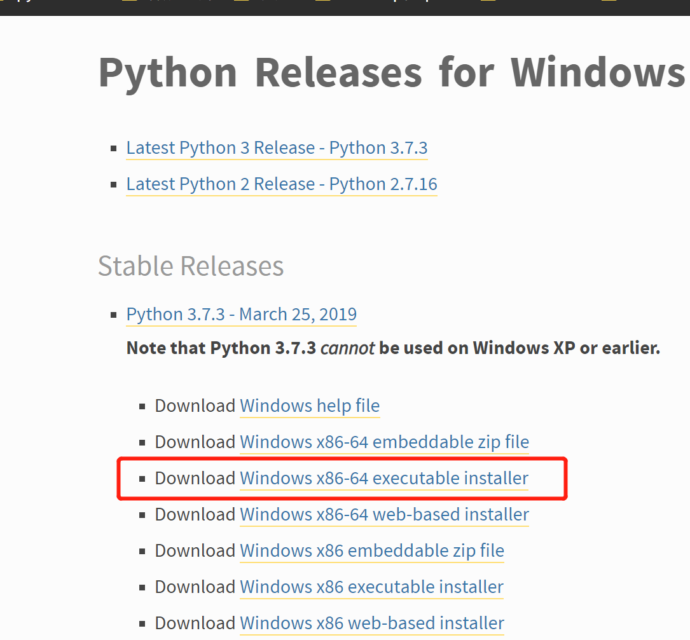
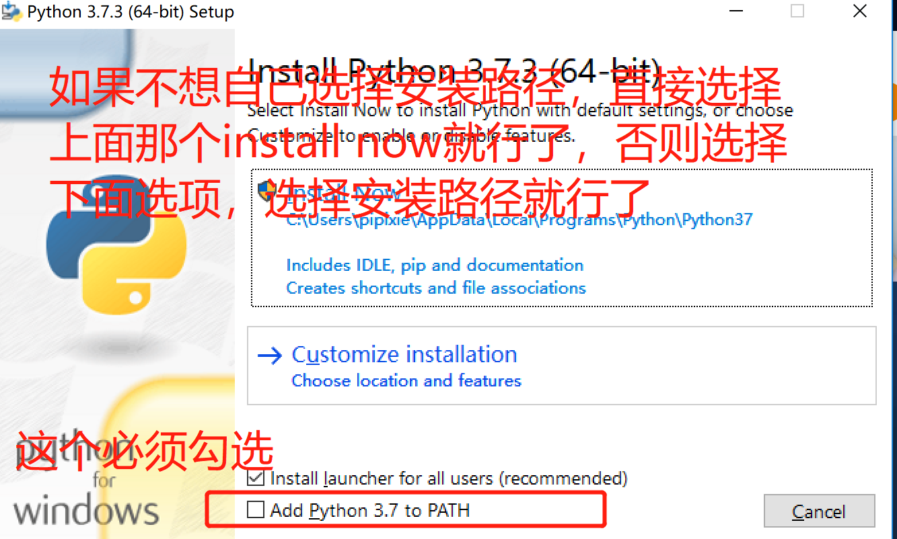
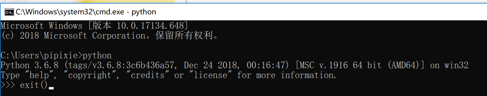

# 音标程序环境安装
1. 前往Python官网[Python官网](https://www.python.org/downloads/windows/)安装Python3

2. 安装Python，双击刚才下载的那个安装包,注意那个截图最下面那个必须勾选，其余默认就行了。

3. 按下win+r,输入cmd打开终端（或者其他途径打开powershell或者终端都可以），输入Python，出现如下图所示的提示说明Python安装成功。安装成功后，输入截图中所示的exit(),退出Python环境。

4. 安装python模块，在终端输入
+ python -m pip install --upgrade pip
+ pip install fake-useragent
+ pip install xlwt
+ pip install requests
+ pip install docx
+ pip install bs4
+ pip install pprint

note:如果发现没有pip,那么在终端执行python get-pip.py,即可安装。

5. 上面步骤没有错误后，切换到目标文件夹，举个例子，如果你把我给你的文件夹放在d:盘下，那么进入这个文件夹后，按下shift键同时，按下鼠标右键，选择在此处打开Powershell,然后执行 python aiciba_yinbiao.py “D:\doc\download\tencent\WeChat Files\xhw18846419675\FileStorage\File\2019-04\英语总复习提纲.docx”

note:aiciba_yinbiao.py是音标那个py文件；后面那个是你电脑中那个文档的路径
