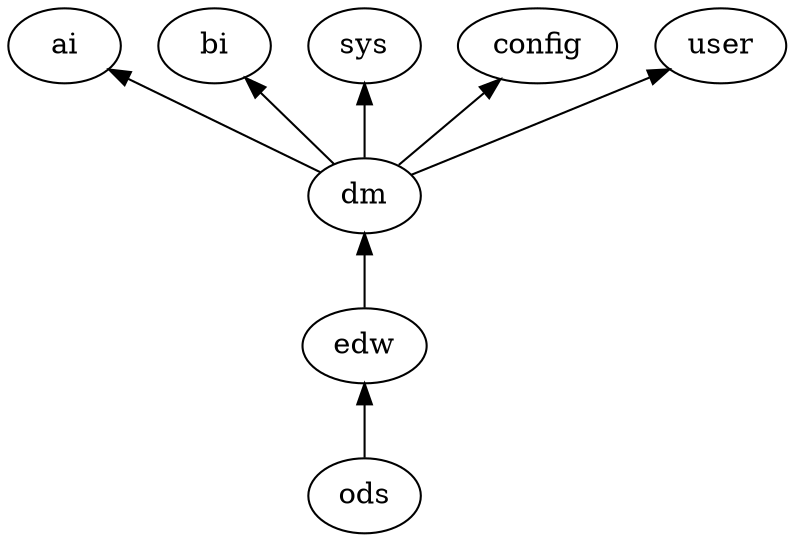

# 1. 2018年10月29日会议纪要
# 2. 1
1.  ods 数据源
2.  edw 明细,中间
3.  dm 指标汇总
4.  ai 和 bi,加上用户权限user(内部认证的实现),sys系统配置,config用户配置,共8个schema(原先的rst层被替代)
# 3. 2
1.   要货sku和销售sku之间的bom表是否必要,待定
2.   涉及订单需求的销售总表与销售明细表是否有冗余,目前意见是先保留
3.   报损表待定,等待调研结果;调拨到货表不要
4.   出入库,order,调拨合为一个io表
